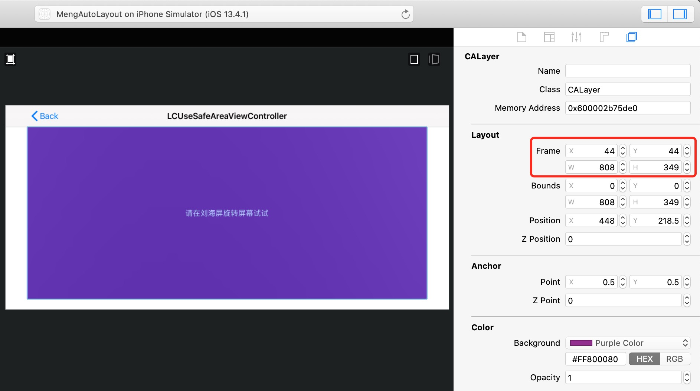
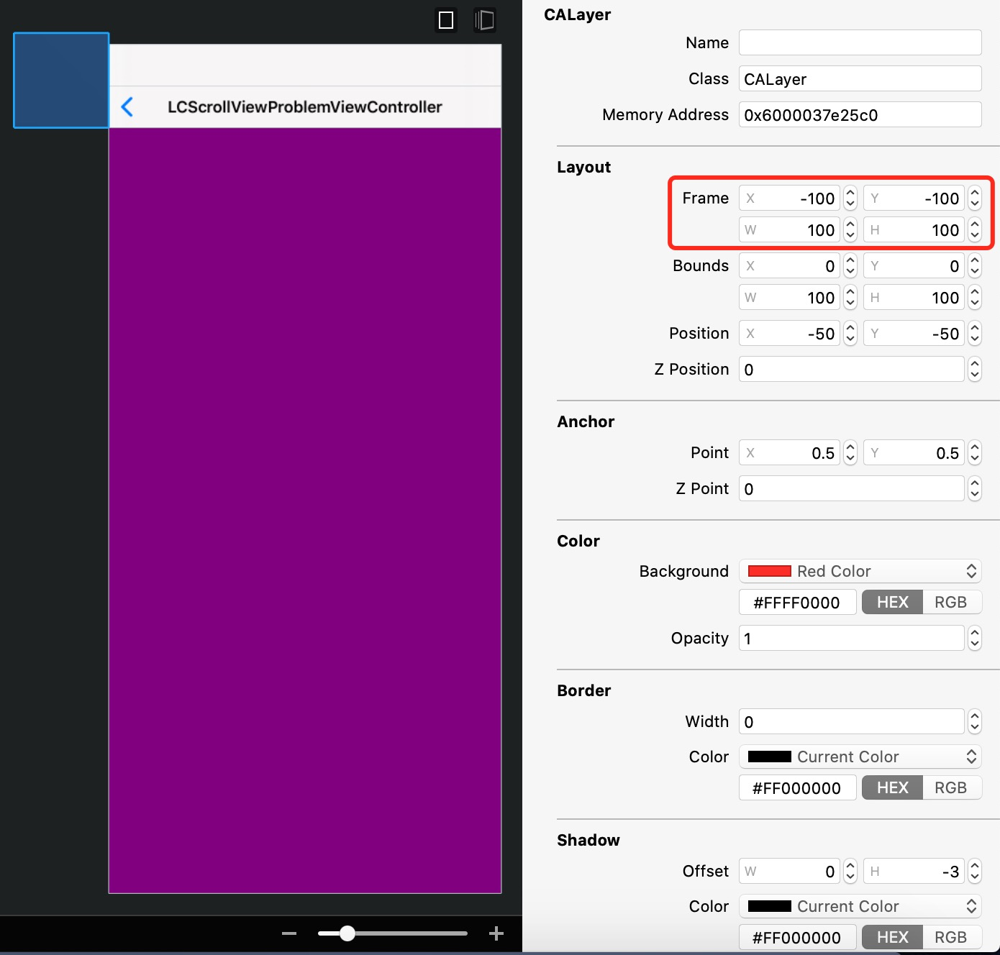

**[GitHub博客地址](https://mlcldh.github.io/iOS/AutoLayout约束的使用)**

**[GitHub Markdown地址](https://github.com/mlcldh/mlcldh.github.io/blob/master/iOS/AutoLayout约束的使用.md)**

## 概述

在iOS 6之前，可以使用UIView的autoresizingMask属性进行自动适配，autoresizingMask是个枚举UIViewAutoresizing 。

```objective-c
typedef NS_OPTIONS(NSUInteger, UIViewAutoresizing) {
    UIViewAutoresizingNone                 = 0,
    UIViewAutoresizingFlexibleLeftMargin   = 1 << 0,
    UIViewAutoresizingFlexibleWidth        = 1 << 1,
    UIViewAutoresizingFlexibleRightMargin  = 1 << 2,
    UIViewAutoresizingFlexibleTopMargin    = 1 << 3,
    UIViewAutoresizingFlexibleHeight       = 1 << 4,
    UIViewAutoresizingFlexibleBottomMargin = 1 << 5
};
```

从iOS 6开始，也就是2012年，苹果推出用约束进行自动布局，约束比UIViewAutoresizing灵活强大多了。

### Cassowary算法

1997年，一个名叫 [Cassowary](https://en.wikipedia.org/wiki/Cassowary_(software)) 的布局算法解决了用户界面的布局问题，它通过将布局问题抽象成线性等式和不等式约束来进行求解。
 Cassowary能够有效解析线性等式系统和线性不等式系统，用来表示用户界面中那些相等关系和不等关系。基于此，Cassowary开发了一种规则系统，通过约束来描述视图间的关系。约束就是规则，这个规则能够表示出一个视图相对于另外一个视图的位置。

由于Cassowary算法让视图位置可以按照一种简单的布局思路来写，这些简单的相对位置描述可以在运行时动态的计算出视图具体的位置。视图位置写法简化，界面相关代码也就更易于维护。苹果公司也是看中了这一点，将其引入了自己的系统中，Auto Layout 其实就是苹果对 Cassowary 算法的一种实现。

### Demo地址

下面讲解涉及的代码已写成Demo，Demo已上传到GitHub，地址如下：

[https://github.com/mlcldh/MengAutoLayout](https://github.com/mlcldh/MengAutoLayout)

其中这个Demo里面使用了我自己的pod库[MLCKit](https://github.com/mlcldh/MLCKit)，里面封装了一些常用的iOS方法。

## 第三方库

Objective-C一般使用[Masonry](https://github.com/SnapKit/Masonry)，Swift使用[SnapKit](https://github.com/SnapKit/SnapKit)。两者有些区别，其中一个就是updateConstraints时，SnapKit要求更新的约束必须是已经存在的约束，否则会报异常。

下面的讲解中，我以Masonry和Objective-C的使用为主。

## 直接调用约束

### 生成约束

```objective-c
//生成一组约束
+ (NSArray<NSLayoutConstraint *> *)constraintsWithVisualFormat:(NSString *)format options:(NSLayoutFormatOptions)opts metrics:(nullable NSDictionary<NSString *, id> *)metrics views:(NSDictionary<NSString *, id> *)views API_AVAILABLE(macos(10.7), ios(6.0), tvos(9.0));
//生成单个约束
+ (instancetype)constraintWithItem:(id)view1 attribute:(NSLayoutAttribute)attr1 relatedBy:(NSLayoutRelation)relation toItem:(nullable id)view2 attribute:(NSLayoutAttribute)attr2 multiplier:(CGFloat)multiplier constant:(CGFloat)c API_AVAILABLE(macos(10.7), ios(6.0), tvos(9.0));
```

```objective-c
//设置A相对于B的约束，那firstItem就是A，secondItem就是B。
@property (nullable, readonly, assign) id firstItem;
@property (nullable, readonly, assign) id secondItem;
@property (readonly) NSLayoutAttribute firstAttribute;
@property (readonly) NSLayoutAttribute secondAttribute;

//关系，分为小于等于、等于、大于等于
@property (readonly) NSLayoutRelation relation;
//比例
@property (readonly) CGFloat multiplier;
//差值
@property CGFloat constant;
```

其中在大部分情况下，NSLayoutAttributeLeading和NSLayoutAttributeLeft效果是一样的，但对于适配阿拉伯语的话，就不一样了，因为阿拉伯语是从右往左的，NSLayoutAttributeLeading就和NSLayoutAttributeRight效果一样了。

### 系统控件自带约束

UILabel、UIButton、UIImageView、UISwitch等几乎所有的系统控件都有自己自带的约束，默认他们会根据自己内容的大小来添加相应约束。

值得注意的是第三方控件YYLabel继承于UIView，YYLabel不能根据自身内容来添加相应约束。

#### 自带约束优先级

当不同系统控件连在一起时，有时会出现其中一个控件把另外一个控件挤扁或拉伸的问题，这时候可以就需要设置控件自带约束的优先级。

其中contentHuggingPriority是抗拉伸，contentCompressionResistancePriority是抗压缩，具体的api如下：

```objective-c
- (UILayoutPriority)contentHuggingPriorityForAxis:(UILayoutConstraintAxis)axis API_AVAILABLE(ios(6.0));
- (void)setContentHuggingPriority:(UILayoutPriority)priority forAxis:(UILayoutConstraintAxis)axis API_AVAILABLE(ios(6.0));

- (UILayoutPriority)contentCompressionResistancePriorityForAxis:(UILayoutConstraintAxis)axis API_AVAILABLE(ios(6.0));
- (void)setContentCompressionResistancePriority:(UILayoutPriority)priority forAxis:(UILayoutConstraintAxis)axis API_AVAILABLE(ios(6.0));
```

### 增加/去掉约束

使用Masonry、SnapKit时，可以调用remakeConstraints来移除view上所有约束，并且重新添加约束。但有时我们只是想移除部分约束。

在iOS 8之前，可以通过调用remove来达到去掉一些约束的目的，不过这些方法未来会被弃用。

```objective-c
//添加单个约束
- (void)addConstraint:(NSLayoutConstraint *)constraint;
//添加一组约束
- (void)addConstraints:(NSArray<__kindof NSLayoutConstraint *> *)constraints;
//移除单个约束
- (void)removeConstraint:(NSLayoutConstraint *)constraint;
//移除一组约束
- (void)removeConstraints:(NSArray<__kindof NSLayoutConstraint *> *)constraints;
```

从iOS 8开始，可以通过操作active来达到去掉一些约束的目的。

```objective-c
//激活单个约束/使单个约束无效
@property (getter=isActive) BOOL active API_AVAILABLE(macos(10.10), ios(8.0));
//激活一组约束
+ (void)activateConstraints:(NSArray<NSLayoutConstraint *> *)constraints;
//使一组约束无效
+ (void)deactivateConstraints:(NSArray<NSLayoutConstraint *> *)constraints;
```

我写了个UIView的Category方法，可以用来移除部分约束：

```objective-c
//移除某一些约束
- (void)mlc_removeConstraintsWithFirstItem:(id)firstItem firstAttribute:(NSLayoutAttribute)firstAttribute {//移除某一些约束
    for (NSLayoutConstraint *constraint in self.constraints) {
        if (constraint.firstItem == firstItem && constraint.firstAttribute == firstAttribute) {
            if (@available(iOS 8.0, *)) {
                constraint.active = NO;
            } else {
                [self removeConstraint:constraint];
            }
        }
    }
}
```

## 约束在哪

UIView有个constraints属性，里面存放了其所有的约束。

```objective-c
@property(nonatomic,readonly) NSArray<__kindof NSLayoutConstraint *> *constraints API_AVAILABLE(ios(6.0));
```

约束存放的规则如下：

1. 当添加的一个约束里面只涉及一个view时，那么该约束就在该view上，比如width和height的。
2. 当一个约束涉及两个view时，如果两个是父视图和子视图的关系，那么约束就在父视图上面，否则就分别递归查找两个view的上一层父视图，当查找到的父视图为同一个时，那么约束就在该父视图上。

Masonry最低支持版本是iOS 6，所以iOS 8之前的系统中，当约束涉及两个视图时，Masonry需要去便利查找两个视图最近的父视图，来添加或移除约束，Masonry就封装了View的一个Category方法，它的实现如下：

```objective-c
- (instancetype)mas_closestCommonSuperview:(MAS_VIEW *)view {
    MAS_VIEW *closestCommonSuperview = nil;

    MAS_VIEW *secondViewSuperview = view;
    while (!closestCommonSuperview && secondViewSuperview) {
        MAS_VIEW *firstViewSuperview = self;
        while (!closestCommonSuperview && firstViewSuperview) {
            if (secondViewSuperview == firstViewSuperview) {
                closestCommonSuperview = secondViewSuperview;
            }
            firstViewSuperview = firstViewSuperview.superview;
        }
        secondViewSuperview = secondViewSuperview.superview;
    }
    return closestCommonSuperview;
}
```

## 调用时机

有些开发者会在layoutSubviews里面添加、删除、修改约束，其实这个还是停留在以前frame布局的思维。

如果你想怎么布局，就立马添加、删除、修改约束就可以了，不用等到layoutSubviews时才执行。

如果在layoutSubviews进行约束操作的话，有出现bug的风险。我以前一个同事就是因为这么做，结果在iOS 8上显示就出了问题，我帮他改掉后就好了。

## 约束绘制

添加、移除、修改约束后，frame不会立马更新，默认会在下个运行时到来时才去更新。另外系统控件自带的约束也不会立即就添加，也要等运行时到来时才添加。

```objc
dispatch_async(dispatch_get_main_queue(), ^{//此时会发现，view的frame都更新了，自身控件的约束也有了
    });
```

```objective-c
@interface UIView (UIConstraintBasedLayoutCoreMethods) 
  
//标记为需要重新布局，异步调用layoutIfNeeded刷新布局，不立即刷新
- (void)setNeedsLayout;
//使约束马上进行绘制
- (void)layoutIfNeeded;

@end
```

## 动画

先修改约束，然后让父视图调用layoutIfNeeded。

比如一个按钮一开始的约束如下：

```objective-c
[button mas_makeConstraints:^(MASConstraintMaker *make) {
        make.left.top.equalTo(self.view).offset(50);
    }];
```

然后做个动画，水平移动到屏幕右侧，可以调用remakeConstraints来实现：

```objective-c
[button mas_remakeConstraints:^(MASConstraintMaker *make) {
                make.right.equalTo(self.view).offset(-50);
                make.top.equalTo(self.view).offset(50);
            }];
[UIView animateWithDuration:2 animations:^{
            [self.view layoutIfNeeded];
        }];
```

也可以先移除掉左边的约束，然后增加个右侧的约束：

```objective-c
[self.view mlc_removeConstraintsWithFirstItem:button firstAttribute:(NSLayoutAttributeLeft)];//我封装的Category方法，上面有实现
            [button mas_makeConstraints:^(MASConstraintMaker *make) {
                make.right.equalTo(self.view).offset(-50);
            }];
[UIView animateWithDuration:2 animations:^{
            [self.view layoutIfNeeded];
        }];
```

## UITableViewCell自适应高度

利用约束实现的使用方法：

1. 需要设置UITableView的rowHeight为UITableViewAutomaticDimension，或者heightForRowAtIndexPath代理方法返回UITableViewAutomaticDimension，其中实现代理方法的优先级比设置rowHeight的高。
2. 为了兼容iOS11以前的系统，需要将estimatedRowHeight设置为一个正数，如果使用UITableViewAutomaticDimension的话，在iOS 11以前的系统会出现cell重叠的问题。其中UITableViewAutomaticDimension的值是-1。
3. 在UITableViewCell内部设置基于其contentView顶部和底部的约束。

```
tableView.estimatedRowHeight = 44.0f;//为了
tableView.rowHeight = UITableViewAutomaticDimension;
```

```objc
- (CGFloat)tableView:(UITableView *)tableView heightForRowAtIndexPath:(NSIndexPath *)indexPath {//相比设置rowHeight，该代理方法的优先级更高
    return UITableViewAutomaticDimension;
}
```

## 安全区域

iOS 11时，苹果推出了安全区域的概念。很多开发者使用宏的方式进行适配安全区域，其实可以使用苹果提供安全区域api，提供约束去适配大部分安全区域的问题。

下面的例子中，按钮button就被设置在安全区域的位置。其中iOS 11以前，可以使用UIViewController的topLayoutGuide和bottomLayoutGuide两个属性来实现top和bottom的安全区域适配，不过这两个属性在iOS 11已经被弃用，当然现在还可以用。

```objective-c
@property(nonatomic,readonly,strong) id<UILayoutSupport> topLayoutGuide API_DEPRECATED("Use view.safeAreaLayoutGuide.topAnchor instead of topLayoutGuide.bottomAnchor", ios(7.0,11.0), tvos(7.0,11.0));
@property(nonatomic,readonly,strong) id<UILayoutSupport> bottomLayoutGuide API_DEPRECATED("Use view.safeAreaLayoutGuide.bottomAnchor instead of bottomLayoutGuide.topAnchor", ios(7.0,11.0), tvos(7.0,11.0));
```

### Masonry的调用

```objective-c
    //注意，当前的edgesForExtendedLayout是默认的UIRectEdgeAll，请看看该button的frame
    UIButton *button = [UIButton buttonWithType:(UIButtonTypeSystem)];
    button.backgroundColor = [UIColor purpleColor];
    [button setTitleColor:[UIColor whiteColor] forState:(UIControlStateNormal)];
    [button setTitle:@"请在刘海屏/非刘海屏上旋转屏幕试试" forState:(UIControlStateNormal)];
    [self.view addSubview:button];
    [button mas_makeConstraints:^(MASConstraintMaker *make) {
        if (@available(iOS 11.0, *)) {
            make.left.equalTo(self.view.mas_safeAreaLayoutGuideLeft);
            make.right.equalTo(self.view.mas_safeAreaLayoutGuideRight);
            make.top.equalTo(self.view.mas_safeAreaLayoutGuideTop);
            make.bottom.equalTo(self.view.mas_safeAreaLayoutGuideBottom);
        } else {
            make.left.right.equalTo(self.view);
            make.top.equalTo(self.mas_topLayoutGuideBottom);
            make.bottom.equalTo(self.mas_bottomLayoutGuideTop);
        }
    }];
```

### SnapKit的调用

```swift
        //注意，当前的edgesForExtendedLayout是默认的UIRectEdgeAll，请看看该button的frame
        let button = UIButton(type: .system)
        button.backgroundColor = UIColor.purple
        button.setTitleColor(.white, for: .normal)
        button.setTitle("请在刘海屏/非刘海屏上旋转屏幕试试", for: .normal)
        view.addSubview(button)
        button.snp_makeConstraints { (make) in
            if #available(iOS 11.0, *) {
                make.left.equalTo(view.safeAreaLayoutGuide.snp.left)
                make.right.equalTo(view.safeAreaLayoutGuide.snp.right)
                make.top.equalTo(view.safeAreaLayoutGuide.snp.top)
                make.bottom.equalTo(view.safeAreaLayoutGuide.snp.bottom)
            } else {
                make.left.right.equalToSuperview()
                make.top.equalTo(topLayoutGuide.snp.bottom)
                make.bottom.equalTo(bottomLayoutGuide.snp.top)
            }
        }
```

### 截图

刘海屏上：




非刘海屏幕上都这样：


### 底层实现

以left和top为例：

```objective-c
    button.translatesAutoresizingMaskIntoConstraints = NO;

    if (@available(iOS 11.0, *)) {
        [NSLayoutConstraint constraintWithItem:button attribute:(NSLayoutAttributeLeft) relatedBy:(NSLayoutRelationEqual) toItem:self.view.safeAreaLayoutGuide attribute:(NSLayoutAttributeLeft) multiplier:1 constant:0].active = YES;
        [NSLayoutConstraint constraintWithItem:button attribute:(NSLayoutAttributeTop) relatedBy:(NSLayoutRelationEqual) toItem:self.view.safeAreaLayoutGuide attribute:(NSLayoutAttributeTop) multiplier:1 constant:0].active = YES;
      
    } else if (@available(iOS 8.0, *)){
        [NSLayoutConstraint constraintWithItem:button attribute:(NSLayoutAttributeLeft) relatedBy:(NSLayoutRelationEqual) toItem:self.view attribute:(NSLayoutAttributeLeft) multiplier:1 constant:0].active = YES;
        [NSLayoutConstraint constraintWithItem:button attribute:(NSLayoutAttributeTop) relatedBy:(NSLayoutRelationEqual) toItem:self.topLayoutGuide attribute:(NSLayoutAttributeBottom) multiplier:1 constant:0].active = YES;
      
    } else {
        [self.view addConstraint:[NSLayoutConstraint constraintWithItem:button attribute:(NSLayoutAttributeLeft) relatedBy:(NSLayoutRelationEqual) toItem:self.view attribute:(NSLayoutAttributeLeft) multiplier:1 constant:0]];
        [self.view addConstraint:[NSLayoutConstraint constraintWithItem:button attribute:(NSLayoutAttributeTop) relatedBy:(NSLayoutRelationEqual) toItem:self.topLayoutGuide attribute:(NSLayoutAttributeBottom) multiplier:1 constant:0]];
    }
```


## 基于UIScrollView的约束

### 问题

UIScrollView是iOS系统非常特殊的一个系统控件，当其contentSize大于其宽度或高度时，其子视图可以在其内部自由滚动。

在基于UIScrollView进行加约束的话，会有些问题。比如下面这块代码，想的是让子视图在UIScrollView的右下角，而实际上子视图被放到了UIScrollView左上角外面。。。

```objective-c
    UIScrollView *scrollView = [[UIScrollView alloc]init];
    scrollView.backgroundColor = [UIColor purpleColor];
    [self.view addSubview:scrollView];
    [scrollView mas_makeConstraints:^(MASConstraintMaker *make) {
        make.edges.equalTo(self.view);
    }];
    
    UIView *boxView = [[UIView alloc]init];
    boxView.backgroundColor = [UIColor redColor];
    [scrollView addSubview:boxView];
    [boxView mas_makeConstraints:^(MASConstraintMaker *make) {
        make.right.bottom.equalTo(scrollView);
        make.width.height.mas_equalTo(100);
    }];
```



### 原因

基于UIScrollView的left、top、width、height都没问题，但基于其right、bottom会存在问题。

需要直接或间距设置基于UIScrollView的宽度约束，其他视图相对于UIScrollView右侧布局才不会有问题；同样道理，需要直接或间距设置基于UIScrollView的高度约束，其他视图相对于UIScrollView底部布局才不会有问题。

### 解决办法

#### 方法1

让子视图基于UIScrollView的父视图的右侧、底部进行布局。

但是当UIScrollView的contentSize大于UIScrollView自身大小时，UIScrollView可以滚动，而该子视图不能随之滚动。

不过这样我们也发现使用约束和frame的一个区别：如果只是使用frame进行布局，UIScrollView的子视图一定会随其以前滚动；而使用约束的话，UIScrollView的子视图可以不随UIScrollView一起滚动。

```objective-c
    CGSize screenSize = [UIScreen mainScreen].bounds.size;
    
    UIScrollView *scrollView = [[UIScrollView alloc]init];
    scrollView.backgroundColor = [UIColor purpleColor];
    if (@available(iOS 11.0, *)) {
        scrollView.contentInsetAdjustmentBehavior = UIScrollViewContentInsetAdjustmentNever;
    }
    scrollView.contentSize = CGSizeMake(screenSize.width + 200, screenSize.height);
    [self.view addSubview:scrollView];
    [scrollView mas_makeConstraints:^(MASConstraintMaker *make) {
        make.edges.equalTo(self.view);
    }];
    
    UIView *boxView = [[UIView alloc]init];
    boxView.backgroundColor = [UIColor redColor];
    [scrollView addSubview:boxView];
    [boxView mas_makeConstraints:^(MASConstraintMaker *make) {
        make.right.bottom.equalTo(self.view);
        make.width.height.mas_equalTo(100);
    }];
```

#### 方法2

直接设置基于UIScrollView的宽度和高度的约束。

```objective-c
    UIScrollView *scrollView = [[UIScrollView alloc]init];
    scrollView.backgroundColor = [UIColor purpleColor];
    if (@available(iOS 11.0, *)) {
        scrollView.contentInsetAdjustmentBehavior = UIScrollViewContentInsetAdjustmentNever;
    }
    [self.view addSubview:scrollView];
    [scrollView mas_makeConstraints:^(MASConstraintMaker *make) {
        make.edges.equalTo(self.view);
    }];
    
    UIView *bgView = [[UIView alloc]init];
    bgView.backgroundColor = [UIColor lightGrayColor];
    [scrollView addSubview:bgView];
    [bgView mas_makeConstraints:^(MASConstraintMaker *make) {
        make.edges.equalTo(scrollView);
        make.width.height.equalTo(scrollView).offset(200);
    }];
    
    UIView *boxView = [[UIView alloc]init];
    boxView.backgroundColor = [UIColor redColor];
    [scrollView addSubview:boxView];
    [boxView mas_makeConstraints:^(MASConstraintMaker *make) {
        make.right.bottom.equalTo(scrollView);
        make.width.height.mas_equalTo(100);
    }];
```

#### 方法3

间接设置基于UIScrollView的宽度和高度的约束。

```objective-c
    UIScrollView *scrollView = [[UIScrollView alloc]init];
    scrollView.backgroundColor = [UIColor purpleColor];
    if (@available(iOS 11.0, *)) {
        scrollView.contentInsetAdjustmentBehavior = UIScrollViewContentInsetAdjustmentNever;
    }
    [self.view addSubview:scrollView];
    [scrollView mas_makeConstraints:^(MASConstraintMaker *make) {
        make.edges.equalTo(self.view);
    }];
    
    CGSize screenSize = [UIScreen mainScreen].bounds.size;
    
    UIView *bgView = [[UIView alloc]init];
    bgView.backgroundColor = [UIColor lightGrayColor];
    [scrollView addSubview:bgView];
    [bgView mas_makeConstraints:^(MASConstraintMaker *make) {
        make.edges.equalTo(scrollView);
        make.width.mas_equalTo(screenSize.width + 200);
        make.height.mas_equalTo(screenSize.height + 200);
    }];
    
    UIView *boxView = [[UIView alloc]init];
    boxView.backgroundColor = [UIColor redColor];
    [scrollView addSubview:boxView];
    [boxView mas_makeConstraints:^(MASConstraintMaker *make) {
        make.right.bottom.equalTo(scrollView);
        make.width.height.mas_equalTo(100);
    }];
```

## UITextView根据内容自适应高度

UITextView继承于UIScrollView，当设置其scrollEnabled属性为NO时，随着其文字内容的变化，UITextView会相应跟着变化。

```objective-c
@property(nonatomic,getter=isScrollEnabled) BOOL scrollEnabled;
```

## 基于其他视图宽高比例的约束


比如下面，下面一个视图的中心点的处于父视图水平三分之一处：

```objective-c
    //让视图中心点的处于父视图水平三分之一处
    UIView *boxView = [[UIView alloc]init];
    boxView.backgroundColor = [UIColor purpleColor];
    [self.view addSubview:boxView];
    [boxView mas_makeConstraints:^(MASConstraintMaker *make) {
        make.centerX.equalTo(self.view.mas_right).multipliedBy(1 / 3.f);
        make.top.equalTo(self.view).offset(100);
        make.width.height.mas_equalTo(100);
    }];
```

## 批量布局控束

### Masonry提供的

Masonry里面有有个NSArray的Category，数组里面都是同一个父视图的子视图，利用这些方法除了可以批量设置、更新约束外，还可以让让里面的子视图规则的分别在父视图上面。

```objective-c
@interface NSArray (MASAdditions)

- (NSArray *)mas_makeConstraints:(void (NS_NOESCAPE ^)(MASConstraintMaker *make))block;
- (NSArray *)mas_updateConstraints:(void (NS_NOESCAPE ^)(MASConstraintMaker *make))block;
- (NSArray *)mas_remakeConstraints:(void (NS_NOESCAPE ^)(MASConstraintMaker *make))block;
//固定子视图的间距
- (void)mas_distributeViewsAlongAxis:(MASAxisType)axisType withFixedSpacing:(CGFloat)fixedSpacing leadSpacing:(CGFloat)leadSpacing tailSpacing:(CGFloat)tailSpacing;
//固定子视图的宽度（水平方向时）/高度（垂直方向时）
- (void)mas_distributeViewsAlongAxis:(MASAxisType)axisType withFixedItemLength:(CGFloat)fixedItemLength leadSpacing:(CGFloat)leadSpacing tailSpacing:(CGFloat)tailSpacing;

@end
```

下面就是在竖屏、横屏上，分别使用了固定子视图水平方向的间距和固定子视图的宽度：


### 自己封装

其实，我们也可以自己去封装一些NSArray的Category，来批量布局子视图，来满足我们不同的业务需求。

比如，上面说到的一组视图，我使每个视图的宽高能自适应，不搞“平均主义”，指让这些视图按照一定的间距连接起来，那就可以使用下面的NSArray的Category方法进行实现。其中mlc_closestCommonSuperview方法和Masonry的mas_closestCommonSuperview的方法内部实现一样。

```objc
- (void)mlc_combineViewsWithAxis:(UILayoutConstraintAxis)axis withFixedSpacing:(CGFloat)fixedSpacing {
    if (self.count < 2) {
        return;
    }
    UIView *lastView = self.firstObject;
    for (NSInteger i = 1; i < self.count; i ++) {
        UIView *view = self[i];
        [self mlc_combineView:view lastView:lastView withAxis:axis fixedSpacing:fixedSpacing];
        lastView = view;
    }
}
- (void)mlc_combineViewsWithAxis:(UILayoutConstraintAxis)axis withFixedSpacings:(NSArray<NSNumber *> *)fixedSpacings {
    if ((self.count < 2) || ((fixedSpacings.count + 1) != self.count)) {
        return;
    }
    UIView *lastView = self.firstObject;
    for (NSInteger i = 1; i < self.count; i ++) {
        UIView *view = self[i];
        CGFloat fixedSpacing = [fixedSpacings[i - 1] doubleValue];
        [self mlc_combineView:view lastView:lastView withAxis:axis fixedSpacing:fixedSpacing];
        lastView = view;
    }
}
- (void)mlc_combineView:(UIView *)view lastView:(UIView *)lastView withAxis:(UILayoutConstraintAxis)axis fixedSpacing:(CGFloat)fixedSpacing  {
    NSLayoutConstraint *constraint = nil;
    if (axis == UILayoutConstraintAxisHorizontal) {
        constraint = [NSLayoutConstraint constraintWithItem:view attribute:(NSLayoutAttributeLeft) relatedBy:(NSLayoutRelationEqual) toItem:lastView attribute:(NSLayoutAttributeRight) multiplier:1 constant:fixedSpacing];
    } else {
        constraint = [NSLayoutConstraint constraintWithItem:view attribute:(NSLayoutAttributeTop) relatedBy:(NSLayoutRelationEqual) toItem:lastView attribute:(NSLayoutAttributeBottom) multiplier:1 constant:fixedSpacing];
    }
    if (@available(iOS 8.0, *)) {
        constraint.active = YES;
    } else {
        UIView *closestCommonSuperview = [view mlc_closestCommonSuperview:lastView];
        [closestCommonSuperview addConstraint:constraint];
    }
}
```

