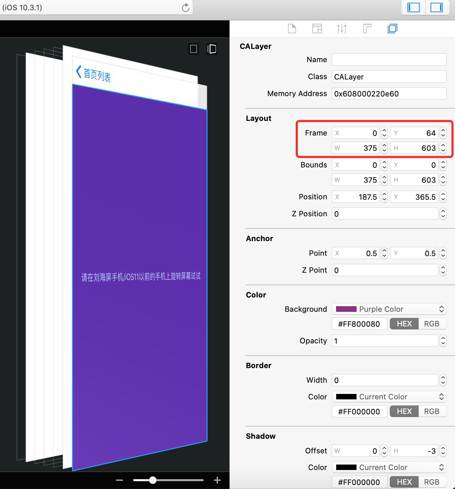

## 概述

在iOS 6之前，可以使用UIView的autoresizingMask属性进行自动适配，autoresizingMask是个枚举UIViewAutoresizing 。

```objective-c
typedef NS_OPTIONS(NSUInteger, UIViewAutoresizing) {
    UIViewAutoresizingNone                 = 0,
    UIViewAutoresizingFlexibleLeftMargin   = 1 << 0,
    UIViewAutoresizingFlexibleWidth        = 1 << 1,
    UIViewAutoresizingFlexibleRightMargin  = 1 << 2,
    UIViewAutoresizingFlexibleTopMargin    = 1 << 3,
    UIViewAutoresizingFlexibleHeight       = 1 << 4,
    UIViewAutoresizingFlexibleBottomMargin = 1 << 5
};
```

从iOS 6开始，也就是2012年，苹果推出用约束进行自动布局，约束比UIViewAutoresizing灵活强大多了。

## 第三方库

Objective-C一般使用[Masonry](https://github.com/SnapKit/Masonry)，Swift使用[SnapKit](https://github.com/SnapKit/SnapKit)。两者有些区别，其中一个就是updateConstraints时，SnapKit邀请更新的约束必须是已经存在的约束，否则会报闪退。

下面的讲解中，我以Masonry和Objective-C的使用为主。

## 直接调用约束

### 生成约束

```objective-c
//生成一组约束
+ (NSArray<NSLayoutConstraint *> *)constraintsWithVisualFormat:(NSString *)format options:(NSLayoutFormatOptions)opts metrics:(nullable NSDictionary<NSString *, id> *)metrics views:(NSDictionary<NSString *, id> *)views API_AVAILABLE(macos(10.7), ios(6.0), tvos(9.0));
//生成单个约束
+ (instancetype)constraintWithItem:(id)view1 attribute:(NSLayoutAttribute)attr1 relatedBy:(NSLayoutRelation)relation toItem:(nullable id)view2 attribute:(NSLayoutAttribute)attr2 multiplier:(CGFloat)multiplier constant:(CGFloat)c API_AVAILABLE(macos(10.7), ios(6.0), tvos(9.0));
```

```objective-c
@property (nullable, readonly, assign) id firstItem;
@property (nullable, readonly, assign) id secondItem;
@property (readonly) NSLayoutAttribute firstAttribute;
@property (readonly) NSLayoutAttribute secondAttribute;

@property (readonly) NSLayoutRelation relation;
@property (readonly) CGFloat multiplier;

@property CGFloat constant;
```

### 系统控件自带约束

UILabel、UIButton、UIImageView等几乎所有的系统控件都有自己自带的约束，默认他们会根据自己内容的大小来添加相应约束。

值得注意的是第三方控件YYLabel继承于UIView，YYLabel不能根据自身内容来添加相应约束。

### 增加/去掉约束

使用Masonry、SnapKit时，可以调用remakeConstraints来移除view上所有约束，并且重新添加约束。但有时我们只是想移除部分约束。

在iOS 8之前，可以通过调用remove来达到去掉一些约束的目的，不过这些方法未来会被弃用。

```objective-c
//添加单个约束
- (void)addConstraint:(NSLayoutConstraint *)constraint;
//添加一组约束
- (void)addConstraints:(NSArray<__kindof NSLayoutConstraint *> *)constraints;
//移除单个约束
- (void)removeConstraint:(NSLayoutConstraint *)constraint;
//移除一组约束
- (void)removeConstraints:(NSArray<__kindof NSLayoutConstraint *> *)constraints;
```

从iOS 8开始，可以通过操作active来达到去掉一些约束的目的。

```objective-c
//激活单个约束/使单个约束无效
@property (getter=isActive) BOOL active API_AVAILABLE(macos(10.10), ios(8.0));
//激活一组约束
+ (void)activateConstraints:(NSArray<NSLayoutConstraint *> *)constraints;
//使一组约束无效
+ (void)deactivateConstraints:(NSArray<NSLayoutConstraint *> *)constraints;
```

我写了个UIView的Category方法，可以用来移除部分约束：

```objective-c
//移除某一些约束
- (void)mlc_removeConstraintsWithFirstItem:(id)firstItem firstAttribute:(NSLayoutAttribute)firstAttribute {//移除某一些约束
    for (NSLayoutConstraint *constraint in self.constraints) {
        if (constraint.firstItem == firstItem && constraint.firstAttribute == firstAttribute) {
            if (@available(iOS 8.0, *)) {
                constraint.active = NO;
            } else {
                [self removeConstraint:constraint];
            }
        }
    }
}
```

## 约束在哪

UIView有个constraints属性，里面存放了其所有的约束。

```objective-c
@property(nonatomic,readonly) NSArray<__kindof NSLayoutConstraint *> *constraints API_AVAILABLE(ios(6.0));
```

约束存放的规则如下：

1. 当添加的一个约束里面只涉及一个view时，那么该约束就在该view上，比如width和height的。
2. 当一个约束涉及两个view时，如果两个是父视图和子视图的关系，那么约束就在父视图上面，否则就分别递归查找两个view的上一层父视图，当查找到的父视图为同一个时，那么约束就在该父视图上。

## 约束绘制

```objective-c
@interface UIView (UIConstraintBasedLayoutCoreMethods) 
  
//使约束在运行时到来是进行绘制
- (void)setNeedsLayout;
//使约束马上进行绘制
- (void)layoutIfNeeded;

@end
```

## 动画

先修改约束，然后让父视图调用layoutIfNeeded。

比如一个按钮一开始的约束如下：

```objective-c
[button mas_makeConstraints:^(MASConstraintMaker *make) {
        make.left.top.equalTo(self.view).offset(50);
    }];
```

然后做个动画，水平移动到屏幕右侧，可以调用remakeConstraints来实现：

```objective-c
[button mas_remakeConstraints:^(MASConstraintMaker *make) {
                make.right.equalTo(self.view).offset(-50);
                make.top.equalTo(self.view).offset(50);
            }];
[UIView animateWithDuration:2 animations:^{
            [self.view layoutIfNeeded];
        }];
```

也可以先移除掉左边的约束，然后增加个右侧的约束：

```objective-c
[self.view mlc_removeConstraintsWithFirstItem:button firstAttribute:(NSLayoutAttributeLeft)];//我封装的Category方法，上面有实现
            [button mas_makeConstraints:^(MASConstraintMaker *make) {
                make.right.equalTo(self.view).offset(-50);
            }];
[UIView animateWithDuration:2 animations:^{
            [self.view layoutIfNeeded];
        }];
```

## 安全区域

iOS 11时，苹果推出了安全区域的概念。

### Masonry的调用

```objective-c
    //注意，当前的edgesForExtendedLayout是默认的UIRectEdgeAll，请看看该button的frame
    UIButton *button = [UIButton buttonWithType:(UIButtonTypeSystem)];
    button.backgroundColor = [UIColor purpleColor];
    [button setTitleColor:[UIColor whiteColor] forState:(UIControlStateNormal)];
    [button setTitle:@"请在刘海屏/非刘海屏上旋转屏幕试试" forState:(UIControlStateNormal)];
    [self.view addSubview:button];
    [button mas_makeConstraints:^(MASConstraintMaker *make) {
        if (@available(iOS 11.0, *)) {
            make.left.equalTo(self.view.mas_safeAreaLayoutGuideLeft);
            make.right.equalTo(self.view.mas_safeAreaLayoutGuideRight);
            make.top.equalTo(self.view.mas_safeAreaLayoutGuideTop);
            make.bottom.equalTo(self.view.mas_safeAreaLayoutGuideBottom);
        } else {
            make.left.right.equalTo(self.view);
            make.top.equalTo(self.mas_topLayoutGuideBottom);
            make.bottom.equalTo(self.mas_bottomLayoutGuideTop);
        }
    }];
```

### SnapKit的调用

```swift
        //注意，当前的edgesForExtendedLayout是默认的UIRectEdgeAll，请看看该button的frame
        let button = UIButton(type: .system)
        button.backgroundColor = UIColor.purple
        button.setTitleColor(.white, for: .normal)
        button.setTitle("请在刘海屏/非刘海屏上旋转屏幕试试", for: .normal)
        view.addSubview(button)
        button.snp_makeConstraints { (make) in
            if #available(iOS 11.0, *) {
                make.left.equalTo(view.safeAreaLayoutGuide.snp.left)
                make.right.equalTo(view.safeAreaLayoutGuide.snp.right)
                make.top.equalTo(view.safeAreaLayoutGuide.snp.top)
                make.bottom.equalTo(view.safeAreaLayoutGuide.snp.bottom)
            } else {
                make.left.right.equalToSuperview()
                make.top.equalTo(topLayoutGuide.snp.bottom)
                make.bottom.equalTo(bottomLayoutGuide.snp.top)
            }
        }
```

### 截图

刘海屏上：


非刘海屏幕上都这样：



### 底层实现

以top为例

```objective-c
    button.translatesAutoresizingMaskIntoConstraints = NO;

    if (@available(iOS 11.0, *)) {
        [NSLayoutConstraint constraintWithItem:button attribute:(NSLayoutAttributeTop) relatedBy:(NSLayoutRelationEqual) toItem:self.view.safeAreaLayoutGuide attribute:(NSLayoutAttributeTop) multiplier:1 constant:0].active = YES;
      
    } else if (@available(iOS 8.0, *)){
        [NSLayoutConstraint constraintWithItem:button attribute:(NSLayoutAttributeTop) relatedBy:(NSLayoutRelationEqual) toItem:self.topLayoutGuide attribute:(NSLayoutAttributeBottom) multiplier:1 constant:0].active = YES;
      
    } else {
        [self.view addConstraint:[NSLayoutConstraint constraintWithItem:button attribute:(NSLayoutAttributeTop) relatedBy:(NSLayoutRelationEqual) toItem:self.topLayoutGuide attribute:(NSLayoutAttributeBottom) multiplier:1 constant:0]];
    }
```


## 基于UIScrollView的约束

### 问题

UIScrollView是iOS系统非常特殊的一个系统控件。

比如下面这块代码，想的是让子视图在UIScrollView的右下角，而实际上子视图被放到了UIScrollView左上角外面。。。

```objective-c
    UIScrollView *scrollView = [[UIScrollView alloc]init];
    scrollView.backgroundColor = [UIColor purpleColor];
    [self.view addSubview:scrollView];
    [scrollView mas_makeConstraints:^(MASConstraintMaker *make) {
        make.edges.equalTo(self.view);
    }];
    
    UIView *boxView = [[UIView alloc]init];
    boxView.backgroundColor = [UIColor redColor];
    [scrollView addSubview:boxView];
    [boxView mas_makeConstraints:^(MASConstraintMaker *make) {
        make.right.bottom.equalTo(scrollView);
        make.width.height.mas_equalTo(100);
    }];
```


### 原因

需要直接或间距设置基于UIScrollView的宽度约束，其他视图相对于UIScrollView右侧布局才不会有问题；同样道理，需要直接或间距设置基于UIScrollView的高度约束，其他视图相对于UIScrollView底部布局才不会有问题。

### 解决办法

#### 方法1

让子视图基于UIScrollView的父视图的右侧、底部进行布局。

但是当UIScrollView的contentSize大于UIScrollView自身大小时，UIScrollView可以滚动，而该子视图不能随之滚动。

不过这样我们也发现使用约束和frame的一个区别：如果只是使用frame进行布局，UIScrollView的子视图一定会随其以前滚动；而使用约束的话，UIScrollView的子视图可以不随UIScrollView一起滚动。

```objective-c
    CGSize screenSize = [UIScreen mainScreen].bounds.size;
    
    UIScrollView *scrollView = [[UIScrollView alloc]init];
    scrollView.backgroundColor = [UIColor purpleColor];
    if (@available(iOS 11.0, *)) {
        scrollView.contentInsetAdjustmentBehavior = UIScrollViewContentInsetAdjustmentNever;
    }
    scrollView.contentSize = CGSizeMake(screenSize.width + 200, screenSize.height);
    [self.view addSubview:scrollView];
    [scrollView mas_makeConstraints:^(MASConstraintMaker *make) {
        make.edges.equalTo(self.view);
    }];
    
    UIView *boxView = [[UIView alloc]init];
    boxView.backgroundColor = [UIColor redColor];
    [scrollView addSubview:boxView];
    [boxView mas_makeConstraints:^(MASConstraintMaker *make) {
        make.right.bottom.equalTo(self.view);
        make.width.height.mas_equalTo(100);
    }];
```

#### 方法2

直接设置基于UIScrollView的宽度和高度的约束。

```objective-c
    UIScrollView *scrollView = [[UIScrollView alloc]init];
    scrollView.backgroundColor = [UIColor purpleColor];
    if (@available(iOS 11.0, *)) {
        scrollView.contentInsetAdjustmentBehavior = UIScrollViewContentInsetAdjustmentNever;
    }
    [self.view addSubview:scrollView];
    [scrollView mas_makeConstraints:^(MASConstraintMaker *make) {
        make.edges.equalTo(self.view);
    }];
    
    UIView *bgView = [[UIView alloc]init];
    bgView.backgroundColor = [UIColor lightGrayColor];
    [scrollView addSubview:bgView];
    [bgView mas_makeConstraints:^(MASConstraintMaker *make) {
        make.edges.equalTo(scrollView);
        make.width.height.equalTo(scrollView).offset(200);
    }];
    
    UIView *boxView = [[UIView alloc]init];
    boxView.backgroundColor = [UIColor redColor];
    [scrollView addSubview:boxView];
    [boxView mas_makeConstraints:^(MASConstraintMaker *make) {
        make.right.bottom.equalTo(scrollView);
        make.width.height.mas_equalTo(100);
    }];
```

#### 方法3

间接设置基于UIScrollView的宽度和高度的约束。

```objective-c
    UIScrollView *scrollView = [[UIScrollView alloc]init];
    scrollView.backgroundColor = [UIColor purpleColor];
    if (@available(iOS 11.0, *)) {
        scrollView.contentInsetAdjustmentBehavior = UIScrollViewContentInsetAdjustmentNever;
    }
    [self.view addSubview:scrollView];
    [scrollView mas_makeConstraints:^(MASConstraintMaker *make) {
        make.edges.equalTo(self.view);
    }];
    
    CGSize screenSize = [UIScreen mainScreen].bounds.size;
    
    UIView *bgView = [[UIView alloc]init];
    bgView.backgroundColor = [UIColor lightGrayColor];
    [scrollView addSubview:bgView];
    [bgView mas_makeConstraints:^(MASConstraintMaker *make) {
        make.edges.equalTo(scrollView);
        make.width.mas_equalTo(screenSize.width + 200);
        make.height.mas_equalTo(screenSize.height + 200);
    }];
    
    UIView *boxView = [[UIView alloc]init];
    boxView.backgroundColor = [UIColor redColor];
    [scrollView addSubview:boxView];
    [boxView mas_makeConstraints:^(MASConstraintMaker *make) {
        make.right.bottom.equalTo(scrollView);
        make.width.height.mas_equalTo(100);
    }];
```

## UITextView根据内容自适应高度

UITextView继承于UIScrollView，当设置其scrollEnabled属性为NO时，随着其文字内容的变化，UITextView会相应跟着变化。

```objective-c
@property(nonatomic,getter=isScrollEnabled) BOOL scrollEnabled;
```

## 基于其他视图宽高比例的约束


比如下面，下面一个视图的中心点的处于父视图水平三分之一处：

```objective-c
    //让视图中心点的处于父视图水平三分之一处
    UIView *boxView = [[UIView alloc]init];
    boxView.backgroundColor = [UIColor purpleColor];
    [self.view addSubview:boxView];
    [boxView mas_makeConstraints:^(MASConstraintMaker *make) {
        make.centerX.equalTo(self.view.mas_right).multipliedBy(1 / 3.f);
        make.top.equalTo(self.view).offset(100);
        make.width.height.mas_equalTo(100);
    }];
```

## Demo

Demo已上传到GitHub，地址如下：

[https://github.com/mlcldh/MengAutoLayout](https://github.com/mlcldh/MengAutoLayout)

