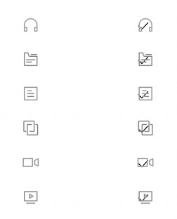

### 现象

iOS项目如果使用了iconfont，给UILabel的字体设置成[UIFont fontWithName:@"iconfont" size:iconSize]，设置的属性字符串里有图片的话，在iOS 15上图片上面就会显示个对号。

如图，其中左边是正常显示的图标，右边是被加上对号的图标：



示例代码如下：

```objective-c
    NSMutableAttributedString *attributedText = [[NSMutableAttributedString alloc]init];
    
    NSTextAttachment *iconAttachment = [[NSTextAttachment alloc] init];
    UIImage *iconImage = [UIImage imageNamed:@"iconName"];
    iconAttachment.image = iconImage;
    [attributedText appendAttributedString:[NSAttributedString attributedStringWithAttachment:iconAttachment]];
    
    UILabel *label = [[UILabel alloc] init];
    label.font = [UIFont fontWithName:@"iconfont" size:12];
    label.attributedText = attributedText;
```

这应该是iconfont渲染图片造成的。

### 解决办法

解决办法有两种：

1. 把UILabel的字体改成普通字体，不使用iconfont字体。
2. 不使用属性字符串，添加图片改成使用text（图片的iconfont字符串）。

